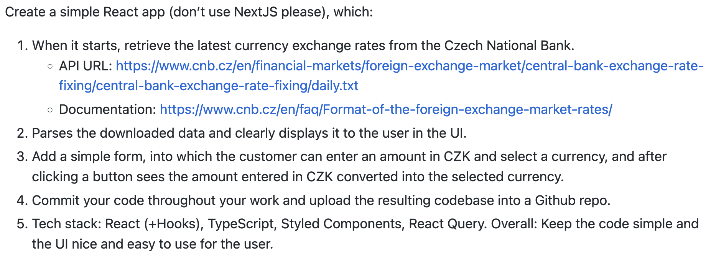

# Currency converter

The purpose of this application is to convert CZK to other currencies according to the ČNB exchange rates.


## Available Scripts

In the project directory, you can run:

```
yarn dev    // runs the app in the development mode
yarn build  // builds client and server parts of the app
yarn start  // starts production build
yarn test   //runs tests
```

### Development mode

Open [http://localhost:8080](http://localhost:8080) for the server.\
Open [http://localhost:3000](http://localhost:3000) to view it in the browser.

### Production mode

Open [http://localhost:8080](http://localhost:8080) to view it in the browser.

## Test coverage


## Instructions

Create a simple React app (don’t use NextJS please), which:


