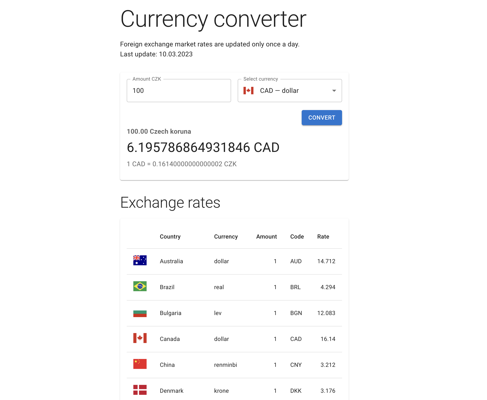

# Currency converter

The purpose of this application is to convert CZK to other currencies according to the ČNB exchange rates.



## Available Scripts

In the project directory, you can run:

```
yarn dev    // runs the app in the development mode
yarn build  // builds client and server parts of the app
yarn start  // starts production build
yarn test   //runs tests
```

### Development mode

Open [http://localhost:8080](http://localhost:8080) for the server.\
Open [http://localhost:3000](http://localhost:3000) to view it in the browser.

### Production mode

Open [http://localhost:8080](http://localhost:8080) to view it in the browser.

## Test coverage


## Instructions

Create a simple React app (don’t use NextJS please), which:

1. When it starts, retrieve the latest currency exchange rates from the Czech National Bank.
   - API URL: https://www.cnb.cz/en/financial-markets/foreign-exchange-market/central-bank-exchange-rate-fixing/central-bank-exchange-rate-fixing/daily.txt
   - Documentation: https://www.cnb.cz/en/faq/Format-of-the-foreign-exchange-market-rates/
2. Parses the downloaded data and clearly displays it to the user in the UI.
3. Add a simple form, into which the customer can enter an amount in CZK and select a currency, and after clicking a button sees the amount entered in CZK converted into the selected currency.
4. Commit your code throughout your work and upload the resulting codebase into a Github repo.
5. Tech stack: React (+Hooks), TypeScript, Styled Components, React Query.
   Overall: Keep the code simple and the UI nice and easy to use for the user.
